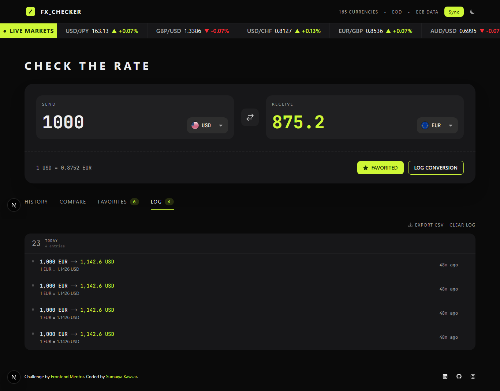

 

# Frontend Mentor - FX Checker Solution

<div align="center">
  <h3>
    <a href="https://sumaiyakawsar.github.io/fx-checker/">
      Demo
    </a>
    <span> | </span>
    <a href="https://github.com/sumaiyakawsar/fx-checker/">
      Solution
    </a>
    <span> | </span>
    <a href="https://www.frontendmentor.io/challenges/foreign-exchange-currency-converter">
      Challenge
    </a>
  </h3>
</div>


---

## 📌 Overview

FX Checker is a full-stack currency exchange application built as my submission for the **Frontend Mentor FM30 Hackathon**.

The goal was to create a modern foreign exchange dashboard where users can convert currencies, monitor exchange rates, compare multiple currencies, track favorites, and analyze historical trends through interactive charts.

This was my first project using Next.js, where I explored modern React architecture, App Router, API integration, data persistence, and scalable application structure while building a scalable currency dashboard.

---

## 🚀 Features

### 💱 Currency Converter

Users can:

- [x] Enter an amount and receive real-time conversion updates
- [x] Select send and receive currencies using a searchable currency picker
- [x] View live exchange rates (example: `1 USD = 0.8530 EUR`)
- [x] Swap currencies instantly
- [x] Favorite currency pairs
- [x] Log conversions
 
 

### 🌎 Currency Picker


- [x] Search through available currencies by code or name
- [x] Group currencies into:
  - Popular currencies
  - Other currencies
- [x] Display:
  - Currency flag
  - Currency code
  - Currency name
- [x] Show the currently selected currency
- [x] Support keyboard navigation and accessibility states

 

### 📈 Live Market Ticker

- [x] A real-time market overview showing:
  -  Popular currency pairs
  -  Current exchange rates
  -  24-hour price changes (Positive and negative) 

 

### 📊 Rate History & Charts

- [x] Interactive line and area charts
- [x] Switch the chart range between 1D, 1W, 1M, 3M, 1Y, and 5Y
- [x] Display [Opening/Latest rate, Absolute/Percentage change]
 
 

### 🔄 Currency Comparison

- [x] See their send amount converted into a range of other currencies at once, each with its reference rate 
- [x] Add/remove comparison currencies
- [x] Pin comparison currencies
 
 

### ⭐ Favorites

Users can manage frequently used currency pairs:

- [x] Save favorite pairs, each with its live rate and 24-hour change
- [x] Load a favorite pair directly into the converter by selecting its row
- [x] Remove unwanted favorites
 
### 📝 Conversion History
 
- [x] See a log of conversions with:
  - Relative conversion time
  - Currency pair
  - Sent amount
  - Received amount

- [x] Delete individual history entries
- [x] Clear complete conversion history


### 🚀 Beyond the Challenge

- [x] Dark and light theme support
- [x] Persist active currency pair in URL
- [x] Shareable conversion URLs
- [x] Custom chart crosshair with date and exchange rate tooltip
- [x] Keyboard shortcuts:
  - Search
  - Currency swap
  - Chart ranges
- [x] API failure handling
- [x] Cached exchange rates
- [x] Outdated rates warning banner
- [x] Loading skeleton states
- [x] Toast notifications for:
  - Currency changes
  - Currency swaps
  - Adding/removing favorites
  - Adding/removing comparison currencies
  - Conversion history actions
- [x] Export the conversion log as a CSV file

- [x] User data is synchronized using:
  - Supabase
  - localStorage fallback
  
---

# 🖥️ UI States

The application gracefully handles common user and network states to provide a smooth user experience.

| State  | Behaviour   |
| ---------------- | --------------- |
| ⭐ Empty Favorites          | Displays a prompt encouraging users to pin their first currency pair.                               |
| 📝 Empty Conversion History | Explains that conversions are automatically recorded once users begin converting currencies.        |
| 🔄 Empty Comparison         | Prompts users to enter a send amount before comparison data is displayed.                           |
| 📈 Chart Error              | Shows a friendly fallback message instead of a broken chart when historical rates cannot be loaded. |
| 🌐 API Offline              | Uses cached exchange rates and displays a stale data warning banner.                                |
| ⏳ Loading                  | Displays loading skeletons while fetching exchange rates and historical data.                       |

  
---

# 🛠️ Built With

## Frontend

[](https://nextjs.org/) [](https://react.dev/) [](https://tailwindcss.com/) [](https://recharts.github.io/) [](https://react-icons.github.io/react-icons/)


## Backend / Database

[](https://supabase.com/) 
 


## Development Tools

[](https://knip.dev/) [](https://pages.github.com/)

## APIs & Services

[](https://frankfurter.dev/) [](https://flagcdn.com/)
  
---

## 🌐 API Endpoints

The application consumes the following Frankfurter API endpoints:

```
GET /v2/currencies
```

Fetch available currencies.

```
GET /v2/rates/USD/EUR
```

Convert currency pairs.

```
GET /v2/rates?base=USD&quotes=EUR
```

Used for:

- Market ticker
- Comparisons
- Live rates

```
GET /v2/rates?base=USD&quotes=EUR&from=DATE&to=DATE
```

Used for historical charts.

---

# 💡 Development Process

## Planning & Setup

Started by defining:

- Component structure
- Application states
- API requirements
- User flows

Main sections:

- Converter
- Currency selection
- Live market ticker
- Rate history
- Compare dashboard
- Favorites
- Conversion history

## Core Development

Implemented:

- Currency conversion flow
- Currency picker
- API integration
- State management
- Favorites system
- Conversion history


## Advanced Improvements

Added:

- Interactive charts
- Keyboard shortcuts
- Theme system
- Supabase synchronization
- Data persistence
- CSV export
- Accessibility improvements


## Optimization

Used:

- Custom React hooks
- Component reusability
- Clean state management
- Knip for detecting unused files and dependencies

 


---

# 📚 What I Learned

While building FX Checker, I improved my understanding of:

## Next.js Development

- Building applications with the App Router
- Client components and state management
- Deployment considerations for static hosting


## ⚡ Challenges & Solutions

### 🌐 API Reliability

| Challenge     | Solution   |
| ------------- | ---------- |
| Exchange rate APIs can fail, become unavailable, or return outdated data, which can affect the user experience. | - Implemented API error handling<br>- Cached the latest successful exchange rates<br>- Added a stale data warning banner when fresh rates cannot be retrieved<br>- Provided fallback behaviour instead of displaying a broken interface |

### 🧩 Managing Complex State

| Challenge     | Solution   |
| ------------- | ---------- |
| The application contains multiple interconnected states such as <br/> <br/> -  Selected currencies <br/> - Favorites <br/> - History <br/> - Comparison currencies <br/> - Theme preferences. <br/> <br/> Managing these states consistently across components was challenging. | - Used React Context for global application states<br>- Created reusable custom hooks for isolated logic<br>- Separated business logic from UI components<br>- Used localStorage for persistence across browser sessions<br>- Integrated Supabase synchronization for user data |
 
### ♿ Accessibility Implementation

| Challenge     | Solution   |
| ------------- | ---------- |
| Financial dashboards contain many interactive elements. Ensuring the application remained accessible required careful planning. | - Added full keyboard navigation support<br>- Implemented visible focus states for interactive elements<br>- Improved screen reader support for dynamic changes<br>- Ensured interactive components have meaningful labels and states |


### 🎨 Theme Management

| Challenge     | Solution   |
| ------------- | ---------- |
| Supporting both dark and light themes while maintaining consistent UI styling across the application required careful state and design management. | - Created a centralized theme context<br>- Persisted user theme preferences<br>- Designed components with theme-aware styling<br>- Ensured colors maintained readability and accessibility standards |
 

### 🗂️ Maintaining Code Quality

| Challenge     | Solution   |
| ------------- | ---------- |
| As the project grew, keeping the codebase clean and avoiding unused files, exports, and dependencies became increasingly important. | - Used reusable component architecture<br>- Organized code using feature-based folders<br>- Created custom hooks to reduce duplication<br>- Used Knip to detect unused files and dependencies<br>- Maintained meaningful commits throughout development |
 

  
---


<!-- ---

# 🔮 Future Improvements

Possible improvements:

- Add more financial data providers
- Add real user authentication flow
- Add exchange rate alerts
- Add mobile PWA support
- Add offline-first capabilities
- Add more advanced market analytics

--- -->

# 📸 Screenshot



---

# 🤖 AI Collaboration

Used AI tools during development for:

- Architecture brainstorming
- Debugging assistance
- Code improvement suggestions
- Documentation refinement
 

### Tools Used

[](https://chatgpt.com/) [](https://claude.ai/)

---

# 👩‍💻 Author
 
[](https://www.frontendmentor.io/profile/sumaiyakawsar) [](https://x.com/SumaiyaKawsar_)
